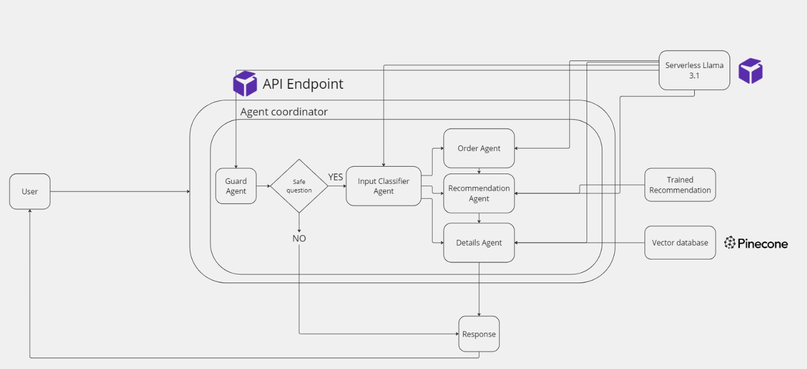

# Coffee Shop Customer Service Chatbot 🚀☕️

Introducing the Coffee Shop Customer Service Chatbot project! This repository provides the code, tools, and guidelines needed to create an AI-driven chatbot aimed at elevating the customer experience within a coffee shop application. By utilizing Large Language Models (LLMs), Natural Language Processing (NLP), and RunPod’s infrastructure, the chatbot can handle order placement, respond to in-depth menu inquiries, and deliver tailored product suggestions—all in one seamless solution.

# 🎯 Project Overview
The goal of this project is to create a smart, **agent-based chatbot** that can:
* Handle real-time customer interactions with the chatbot including orders.
* Answer questions about menu items, including ingredients and allergens through a **Retreival augmented Generation (RAG) system**.
* Provide personalized product recommendations through a **market basket analysis recommendation engine**.
* Guide customers through a seamless order process, ensuring accurate and structured order details.
* Block irrelevant or harmful queries using a Guard Agent for safe and relevant interactions.

## 🧠 Chatbot Agent Architecture


### 🤖 Key Agents in the System:
1. **Guard Agent:**
Serving as the initial filter, the Guard Agent reviews all incoming user messages to ensure only relevant, safe queries move on to the other agents. It blocks any inappropriate, harmful, or off-topic content, helping maintain a secure and seamless user experience.
2. **Order Taking Agent:**
This agent guides customers through placing orders. By using chain-of-thought prompt engineering to mimic human reasoning, it carefully structures orders and captures every customer preference. It ensures the chatbot collects all necessary details methodically, producing a reliable final order.
3. **Details Agent (RAG System):**
Built on a Retrieval-Augmented Generation (RAG) framework, the Details Agent addresses specific questions about the coffee shop—like menu items, ingredients, allergens, and general FAQs. It pulls data from a vector database and merges it with language generation features to provide precise, informative answers.
4. **Recommendation Agent:**
Relying on a market basket recommendation system, this agent offers personalized product suggestions. Activated by the Order Taking Agent, it examines the user’s current order or stated preferences to propose complementary items, with the aim of boosting upsells and helping customers explore new offerings.
5. **Classification Agent:**
As the decision-maker, the Classification Agent assigns incoming user queries to the correct agent. By identifying user intent—be it requesting a recommendation, placing an order, or asking about menu details—it ensures each query is directed to the most suitable agent for efficient resolution.

### ⚙️ How the Agents Work Together
The agents work collaboratively in a pipeline architecture to process user inputs:

1. A customer query is received and first assessed by the Guard Agent.
2. If valid, the Classification Agent determines the intent behind the user query (e.g., placing an order, asking about a product, or requesting a recommendation).
3. The query is then forwarded to the appropriate agent:
    * The Order Taking Agent handles order-related queries.
        * Order Agent can forward the order to the recommendation agent to try and upsell the user near the end of their order.
    * The Details Agent fetches specific menu information.
    * The Recommendation Agent suggests complementary products.

# 📂 Directory Structure
```bash
├── coffee_shop_customer_service_chatbot  
│   ├── python_code
│       ├── API/               # Chatbot API for agent-based system
│       ├── dataset/           # Dataset for training recommendation engine    
│       ├── products/          # Product data (names, prices, descriptions, images)   
│       ├── build_vector_database.ipynb             # Builds vector database for RAG model   
│       ├── firebase_uploader.ipynb                 # Uploads products to Firebase    
│       ├── recommendation_engine_training.ipynb    # Trains recommendation engine 
```
